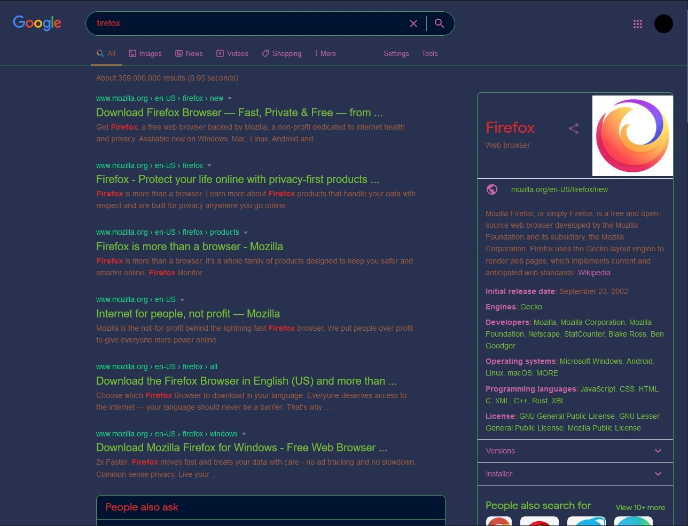

# Google Dark - Rainbow

Customizable theme for most Google sites, dark by default.

You can change the color options based on your liking under style manager. It works on more than ten popular Google services, with the notable exceptions of Gmail and Google Support as they already have dark mode.

## Installation

To install the usercss, you need **Stylus**. You can get it from [Chrome webstore](https://chrome.google.com/webstore/detail/stylus/clngdbkpkpeebahjckkjfobafhncgmne) or [Mozilla add-ons](https://addons.mozilla.org/en-US/firefox/addon/styl-us/).

Once you have, click here:

## Screenshots

|   Default    |  Example style  | Example style |
| ------------ | --------------- | ------------- |
|  |  |  | 

Preset for the 2nd screenshot
* Background #140028
* Overlay #3c1e50
* Border #460a64
* Dark text #3246aa
* Light text #6482be
* Buttons/Links #14b4a0
* Hyperlink #be140a
* Website name #fafa00

Preset for the 3rd screenshot
* Background #283250
* Overlay #001432
* Border #3ca05a
* Dark text #a05a3c
* Light text #d22828
* Buttons/Links #c864a0
* Hyperlink #78be32
* Website name #14dc8c
